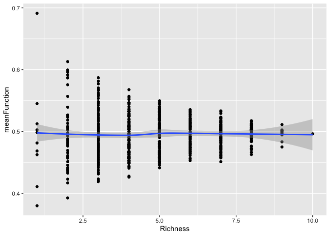
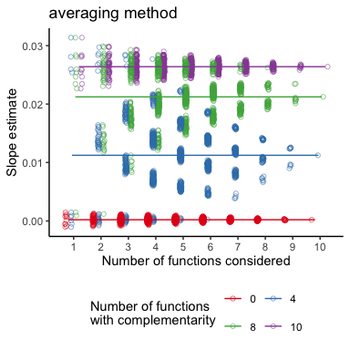
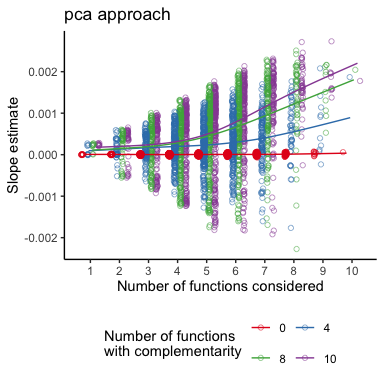
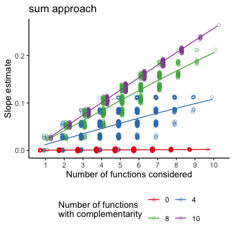
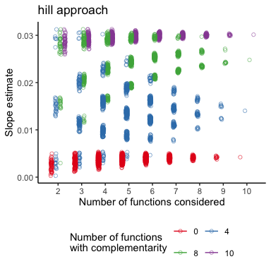

Effect of varying number of functions and species on the slope of the
multithreshold and the averaging approach
================
Fabian Roger
2019-09-06

This script produces:

  - Figure 2 b & c

(see `Effect on averaging approach` below for Figure 2 a)

This script sets up the simulations to show the effect of including a
varying number of functions and (separately) a varying number of species
on the slope pattern produced by the multithreshold approach.

For the **variable number of function simulation** we hold species
richness constant at `specnum`.

We then define a set number of functions of size `funcnum` from which we
draw all possible (but max 50) subsets of variable size (3 subsets-sizes
total). For each subset of functions we calculate the multithreshold
approach.

For the **variable number of species simulation** we hold the number of
functions constant at `funcnum` but calculate the multithreshold
approach for the full species range and two smaller subsets.

# Effect on multithreshold approach

## Variable number of function simulation

### Simulate full diversity experiment

One can set the same parameters as in most other simulations:

  - `distribution` : the distribution function. The names of the
    parameters must be changed accordingly in `FunctionValue()`
  - `specnum` : the (maximum) number of species
  - `funcnum` : the (maximum) number of functions
  - `method` : the method to use (with or without complementarity)

Additional parameters for `method = comp`:

  - `CF` : maximum complementarity factor
  - `compfunc` : which functions should experience complementarity
    (`all` or any combination of `func.names`)
  - `r` : the *growthrate* of the complementarity factor

Here we use a maximum replication of 200 unique species combinations as
otherwise the computation becomes tedious.

``` r
set.seed(777)

specnum <- 10
funcnum <- 10

distribution = "runif"

FuncMat <- FunctionValue(specnum,funcnum, distribution, min = 0.1, max = 0.9)

func.names <- as.character( unique( FuncMat$Functions))
spec.names <- as.character( unique( FuncMat$Species))

#maxrep <- choose(specnum, floor(specnum/2))
maxrep <- 100 #using the full replications is prohibitive

SpecMat <- SpeciesMatrix(specnum = specnum, maxrep = maxrep)

method = "av"

compfunc <- func.names[1:3]


AvFunc <- AverageFunction(SpecMat, FuncMat,
                          method = method, 
                          compfunc = compfunc)

set.seed(563)
errM <- matrix(rnorm(n = nrow(AvFunc)*funcnum, mean = 0, sd = 0.01), ncol = funcnum)

#add variance
AvFunc[,func.names] <- AvFunc[,func.names] + errM

# standardize functions 
AvFunc_func <- AvFunc %>% 
  mutate_at(vars(one_of(func.names)), function(x) {(x) / max(x)})
  #mutate_at(vars(one_of(func.names)), function(x) {(x - min(x)) / (max(x) - min(x))})
```

``` r
AvFunc %>%
mutate(meanFunction = rowMeans(.[,func.names])) %>% 
ggplot(., aes(x = Richness, y = meanFunction))+
  geom_point()+
  geom_smooth()
```

    ## `geom_smooth()` using method = 'loess' and formula 'y ~ x'

<!-- -->

### Variable number of function - Multithreshold

``` r
# empty dataframe to store results
RES_func_multi <- tibble(thresholds = numeric(), 
                   Estimate = numeric(), 
                   nfunc = numeric(),
                   func_comb = numeric())

#loop over chosen subsets of all function of varying size
for (i in c(ceiling(funcnum/3), 2*ceiling(funcnum/3), funcnum)) { 

  # all poosibel combination of i out of funcnum functions
  func_comb <- combn(func.names, i)
  
  # sample 50 random function combinations if more than 50 possible combinations
  if(ncol(func_comb) > 50) {
    func_comb <- func_comb[, sample(c(1:ncol(func_comb)), 50)]
  }

  #loop over all function combinations of size i
  for ( k  in seq_len(ncol(func_comb))) { 
    
    # number of functions above threshold
    mixedThresh <- getFuncsMaxed(AvFunc, func_comb[ ,k], threshmin=0.01,
                                 threshmax=0.99, threshstep=0.05, prepend=c("Richness"), maxN=1)
    # slopes  
    mixedLinearSlopes<-getCoefTab(funcMaxed ~ Richness, fun = lm, 
                                  data=mixedThresh, coefVar="Richness")
    
    colnames(mixedLinearSlopes) <- c("thresholds", "Estimate",
                                     "Std. Error", "t value", "Pr(>|t|)")
    
    temp <- mixedLinearSlopes %>% 
      select(thresholds, Estimate) %>% 
      mutate(nfunc = i) %>% 
      mutate(func_comb = k)
    
    RES_func_multi <- rbind(RES_func_multi, temp)
  }
  }
```

### Plot Multithreshold

``` r
FUNC_multi <- RES_func_multi %>% 
  group_by(thresholds, nfunc) %>% 
  summarise(mean_Estimate = mean(Estimate),
            CI_high = mean(Estimate) + 1.96 * (sd(Estimate)/sqrt(n())),
            CI_low = mean(Estimate) - 1.96 * (sd(Estimate)/sqrt(n()))) %>% 
ggplot(., aes(x=thresholds*100, y=mean_Estimate), size = 0.5, alpha = 0.3)+
  geom_ribbon(aes(ymin = CI_low, ymax = CI_high, fill = as.factor(nfunc)), colour = NA, alpha = 0.4)+
  geom_line( aes(colour = as.factor(nfunc)), lwd = 0.8) +
  ylab("Slope estimate") + xlab("Threshold (%)") +
  geom_abline(intercept=0, slope=0, lwd=0.5, linetype=2) + 
  theme_bw(base_size=15)+
  scale_fill_brewer(guide = FALSE, palette = "Set1")+
  scale_color_brewer(guide = guide_legend(title = paste("Number of functions", 
                                                        paste("(", specnum, " species)", 
                                                              sep = ""), sep = "\n"),
                                          nrow=2,byrow=TRUE),
                     palette = "Set1")+
  ggtitle("multiple thresholds") +
  theme_classic()+
  theme(legend.position = "bottom")+
  #scale_y_continuous(limits = c(-0.45, 0.45))+
  NULL
  
FUNC_multi
```

<!-- -->

### Variable number of function - Averaging

### simulation of all possible slopes for 1:`funcnum` functions

``` r
# empty dataframe to store results
Slope_res_ave1 <- data.frame(Estimate = numeric(),
                        `Std. Error` = numeric(),
                        `t value` = numeric(),    
                        `Pr(>|t|)` = numeric(),
                        nfunc = numeric(),
                        ncomp = numeric())

# loop over all possible number of functions with complementarity
for (l in 0:funcnum) {
  
set.seed(999)

# choose method = average if no functions with complementarity and method = comp otherwise
  if(l == 0) {
    method = "av"
  }  else {
    method = "comp"
    compfunc = func.names[1:l]
  }

# draw function values and calculate mean function for all richness levels
AvFunc <- AverageFunction(SpecMat, FuncMat,
                          method = method, 
                          compfunc = compfunc)

set.seed(563)
errM <- matrix(rnorm(n = nrow(AvFunc)*funcnum, mean = 0, sd = 0.01), ncol = funcnum)

#add variance
AvFunc[,func.names] <- AvFunc[,func.names] + errM

# standardize functions
AvFunc <- AvFunc %>% 
  select(Richness, one_of(func.names)) %>% 
  mutate_at(vars(one_of(func.names)), function(x) {x / max(x)})
  #mutate_at(vars(one_of(func.names)), function(x) {(x - min(x)) / (max(x) - min(x))})


# loop over all subsets of function of size 1:funcnum
for (i in seq_len(funcnum)) { 

  # all poosibel combination of i out of funcnum functions
  func_comb <- combn(func.names, i)
  
  # loop over all function combinations of size i
  for ( k  in seq_len(ncol(func_comb))) { 
  
    # calculate mean function
    AvFunc_temp <- AvFunc %>%
      select(Richness, one_of(func_comb[ ,k])) %>% 
      mutate(meanFunction = rowMeans(.[func_comb[ ,k]]))
  
    # fit linear model
    mod <- lm(meanFunction ~ Richness, data = AvFunc_temp)
  
    # get slope estimate
    est <- summary(mod)$coefficients[2,]
    
    # store results
    Slope_res_ave1 <- data.frame(t(est)) %>% 
      mutate(., nfunc = i) %>% 
      mutate(ncomp = l) %>% 
      rbind(Slope_res_ave1, .)
  }
}
}
```

### Plot

``` r
plot_av1 <- Slope_res_ave1 %>% 
  filter(ncomp %in% c(0,ceiling(funcnum/3),2*ceiling(funcnum/3),funcnum)) %>% 
  ggplot(aes(x = nfunc, y = Estimate, colour = as.factor(ncomp)))+
  geom_point(position = position_jitterdodge(jitter.width = 0.2, jitter.height = 0, dodge.width = 0.75),
             alpha = 0.5, shape = 21)+
  geom_smooth( se = F, size = 0.5, 
              position = position_dodge(width = 0.5))+
  scale_color_brewer(guide = guide_legend(title = "Number of functions\nwith complementarity",
                                          nrow=2,byrow=TRUE),
                     palette = "Set1")+
  scale_x_continuous(breaks = seq(1,funcnum,1))+
 # scale_y_continuous(limits = c(NA, 0.038))+
  labs(y = "Slope estimate",
       x = "Number of functions considered")+
  ggtitle("averaging method") +
  theme_classic()+
  theme(legend.position = "bottom")
  
 plot_av1 
```

    ## `geom_smooth()` using method = 'gam' and formula 'y ~ s(x, bs = "cs")'

    ## Warning: position_dodge requires non-overlapping x intervals

<!-- -->

### Variable number of function - PCA multifunc

``` r
# empty dataframe to store results
Slope_res_pca1 <- data.frame(Estimate = numeric(),
                        `Std. Error` = numeric(),
                        `t value` = numeric(),    
                        `Pr(>|t|)` = numeric(),
                        nfunc = numeric(),
                        ncomp = numeric())

# loop over all possible number of functions with complementarity
for (l in c(0,ceiling(funcnum/3),2*ceiling(funcnum/3),funcnum)) {
  
set.seed(999)

# choose method = average if no functions with complementarity and method = comp otherwise
  if(l == 0) {
    method = "av"
  }  else {
    method = "comp"
    compfunc = func.names[1:l]
  }

# draw function values and calculate mean function for all richness levels
AvFunc <- AverageFunction(SpecMat, FuncMat,
                          method = method, 
                          compfunc = compfunc)

set.seed(563)
errM <- matrix(rnorm(n = nrow(AvFunc)*funcnum, mean = 0, sd = 0.01), ncol = funcnum)

#add variance
AvFunc[,func.names] <- AvFunc[,func.names] + errM

# standardize functions
AvFunc <- AvFunc %>% 
  select(Richness, one_of(func.names)) %>% 
  mutate_at(vars(one_of(func.names)), function(x) {x / max(x)})
  #mutate_at(vars(one_of(func.names)), function(x) {(x - min(x)) / (max(x) - min(x))})


# loop over all subsets of function of size 1:funcnum
for (i in seq_len(funcnum)) { 

  # all poosibel combination of i out of funcnum functions
  func_comb <- combn(func.names, i)
  
  # loop over all function combinations of size i
  for ( k  in seq_len(ncol(func_comb))) { 
  
    # calculate pca multifunc index
    AvFunc_temp <- pca_multifunc(AvFunc, vars = func_comb[ ,k]) 
  
    # fit linear model
    mod <- lm(multifunc_pca_ind ~ Richness, data = AvFunc_temp)
  
    # get slope estimate
    est <- summary(mod)$coefficients[2,]
    
    # store results
    Slope_res_pca1 <- data.frame(t(est)) %>% 
      mutate(., nfunc = i) %>% 
      mutate(ncomp = l) %>% 
      rbind(Slope_res_pca1, .)
  }
}
}
```

### Plot

``` r
plot_pca1 <- Slope_res_pca1 %>% 
  filter(ncomp %in% c(0,ceiling(funcnum/3),2*ceiling(funcnum/3),funcnum)) %>% 
  ggplot(aes(x = nfunc, y = Estimate, colour = as.factor(ncomp)))+
  geom_point(position = position_jitterdodge(jitter.width = 0.2, jitter.height = 0, dodge.width = 0.75),
             alpha = 0.5, shape = 21)+
  geom_smooth(se = F, size = 0.5, 
              position = position_dodge(width = 0.5))+
  scale_color_brewer(guide = guide_legend(title = "Number of functions\nwith complementarity",
                                          nrow=2,byrow=TRUE),
                     palette = "Set1")+
  scale_x_continuous(breaks = seq(1,funcnum,1))+
  #scale_y_continuous(limits = c(NA, 0.038))+
  labs(y = "Slope estimate",
       x = "Number of functions considered")+
  ggtitle("pca approach") +
  theme_classic()+
  theme(legend.position = "bottom")
  
 plot_pca1 
```

    ## `geom_smooth()` using method = 'gam' and formula 'y ~ s(x, bs = "cs")'

    ## Warning: position_dodge requires non-overlapping x intervals

<!-- -->

### Variable number of function - Sum multifunc

``` r
# empty dataframe to store results
Slope_res_sum1 <- data.frame(Estimate = numeric(),
                        `Std. Error` = numeric(),
                        `t value` = numeric(),    
                        `Pr(>|t|)` = numeric(),
                        nfunc = numeric(),
                        ncomp = numeric())

# loop over all possible number of functions with complementarity
for (l in c(0,ceiling(funcnum/3),2*ceiling(funcnum/3),funcnum)) {
  
set.seed(999)

# choose method = average if no functions with complementarity and method = comp otherwise
  if(l == 0) {
    method = "av"
  }  else {
    method = "comp"
    compfunc = func.names[1:l]
  }

# draw function values and calculate mean function for all richness levels
AvFunc <- AverageFunction(SpecMat, FuncMat,
                          method = method, 
                          compfunc = compfunc)

set.seed(563)
errM <- matrix(rnorm(n = nrow(AvFunc)*funcnum, mean = 0, sd = 0.01), ncol = funcnum)

#add variance
AvFunc[,func.names] <- AvFunc[,func.names] + errM

# standardize functions
AvFunc <- AvFunc %>% 
  select(Richness, one_of(func.names)) %>% 
  mutate_at(vars(one_of(func.names)), function(x) {x / max(x)})
  #mutate_at(vars(one_of(func.names)), function(x) {(x - min(x)) / (max(x) - min(x))})


# loop over all subsets of function of size 1:funcnum
for (i in seq_len(funcnum)) { 

  # all poosibel combination of i out of funcnum functions
  func_comb <- combn(func.names, i)
  
  # loop over all function combinations of size i
  for ( k  in seq_len(ncol(func_comb))) { 
  
    # calculate sum of functions
    AvFunc_temp <- AvFunc %>%
      select(Richness, one_of(func_comb[ ,k])) %>% 
      mutate(sumFunction = rowSums(.[func_comb[ ,k]]))
  
  
    # fit linear model
    mod <- lm(sumFunction ~ Richness, data = AvFunc_temp)
  
    # get slope estimate
    est <- summary(mod)$coefficients[2,]
    
    # store results
    Slope_res_sum1 <- data.frame(t(est)) %>% 
      mutate(., nfunc = i) %>% 
      mutate(ncomp = l) %>% 
      rbind(Slope_res_sum1, .)
  }
}
}
```

### Plot

``` r
plot_sum1 <- Slope_res_sum1 %>% 
  filter(ncomp %in% c(0,ceiling(funcnum/3),2*ceiling(funcnum/3),funcnum)) %>% 
  ggplot(aes(x = nfunc, y = Estimate, colour = as.factor(ncomp)))+
  geom_point(position = position_jitterdodge(jitter.width = 0.2, jitter.height = 0, dodge.width = 0.75),
             alpha = 0.5, shape = 21)+
  geom_smooth( se = F, size = 0.5, 
              position = position_dodge(width = 0.5))+
  scale_color_brewer(guide = guide_legend(title = "Number of functions\nwith complementarity",
                                          nrow=2,byrow=TRUE),
                     palette = "Set1")+
  scale_x_continuous(breaks = seq(1,funcnum,1))+
  #scale_y_continuous(limits = c(NA, 0.038))+
  labs(y = "Slope estimate",
       x = "Number of functions considered")+
  ggtitle("sum approach") +
  theme_classic()+
  theme(legend.position = "bottom")
  
 plot_sum1 
```

    ## `geom_smooth()` using method = 'gam' and formula 'y ~ s(x, bs = "cs")'

    ## Warning: position_dodge requires non-overlapping x intervals

<!-- -->

### Variable number of function - Hill multifunc

``` r
# empty dataframe to store results
Slope_res_hill1 <- data.frame(Estimate = numeric(),
                        `Std. Error` = numeric(),
                        `t value` = numeric(),    
                        `Pr(>|t|)` = numeric(),
                        nfunc = numeric(),
                        ncomp = numeric())

# loop over all possible number of functions with complementarity
for (l in c(0,ceiling(funcnum/3),2*ceiling(funcnum/3),funcnum)) {
  
set.seed(999)

# choose method = average if no functions with complementarity and method = comp otherwise
  if(l == 0) {
    method = "av"
  }  else {
    method = "comp"
    compfunc = func.names[1:l]
  }

# draw function values and calculate mean function for all richness levels
AvFunc <- AverageFunction(SpecMat, FuncMat,
                          method = method, 
                          compfunc = compfunc)

set.seed(563)
errM <- matrix(rnorm(n = nrow(AvFunc)*funcnum, mean = 0, sd = 0.01), ncol = funcnum)

#add variance
AvFunc[,func.names] <- AvFunc[,func.names] + errM

# standardize functions
AvFunc <- AvFunc %>% 
  select(Richness, one_of(func.names)) %>% 
  mutate_at(vars(one_of(func.names)), function(x) {x / max(x)})
  #mutate_at(vars(one_of(func.names)), function(x) {(x - min(x)) / (max(x) - min(x))})


# loop over all subsets of function of size 2:funcnum
for (i in 2:funcnum) { 

  # all poosibel combination of i out of funcnum functions
  func_comb <- combn(func.names, i)
  
  # loop over all function combinations of size i
  for ( k  in seq_len(ncol(func_comb))) { 
  
    # calculate sum of functions
    AvFunc_temp <- hill_multifunc(AvFunc, vars = func_comb[ ,k],
                                  scale = 1, HILL = FALSE)
  
    # fit linear model
    mod <- lm(multifunc_effN ~ Richness, data = AvFunc_temp)
  
    # get slope estimate
    est <- summary(mod)$coefficients[2,]
    
    # store results
    Slope_res_hill1 <- data.frame(t(est)) %>% 
      mutate(., nfunc = i) %>% 
      mutate(ncomp = l) %>% 
      rbind(Slope_res_hill1, .)
  }
}
}
```

### Plot

``` r
plot_hill1 <- Slope_res_hill1 %>% 
  filter(ncomp %in% c(0,ceiling(funcnum/3),2*ceiling(funcnum/3),funcnum)) %>% 
  ggplot(aes(x = nfunc, y = Estimate, colour = as.factor(ncomp)))+
  geom_point(position = position_jitterdodge(jitter.width = 0.2, jitter.height = 0, dodge.width = 0.75),
             alpha = 0.5, shape = 21)+
  geom_smooth( se = F, size = 0.5, 
              position = position_dodge(width = 0.5))+
  scale_color_brewer(guide = guide_legend(title = "Number of functions\nwith complementarity",
                                          nrow=2,byrow=TRUE),
                     palette = "Set1")+
  scale_x_continuous(breaks = seq(1,funcnum,1))+
  #scale_y_continuous(limits = c(NA, 0.038))+
  labs(y = "Slope estimate",
       x = "Number of functions considered")+
  ggtitle("hill approach") +
  theme_classic()+
  theme(legend.position = "bottom")
  
 plot_hill1
```

    ## `geom_smooth()` using method = 'gam' and formula 'y ~ s(x, bs = "cs")'

    ## Warning: Computation failed in `stat_smooth()`:
    ## x has insufficient unique values to support 10 knots: reduce k.

<!-- -->
