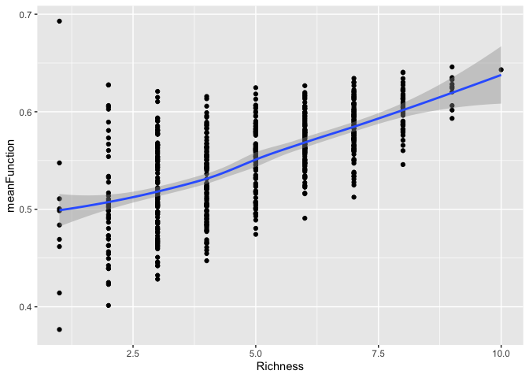
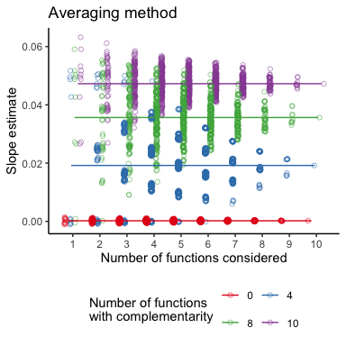
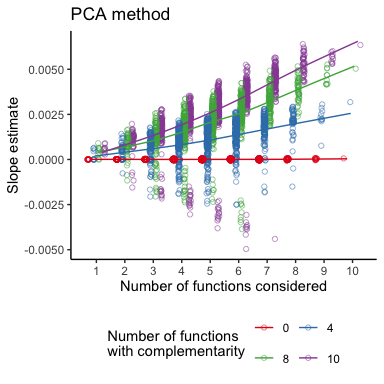
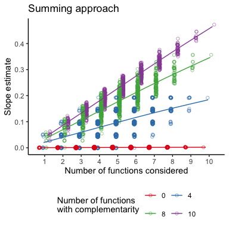
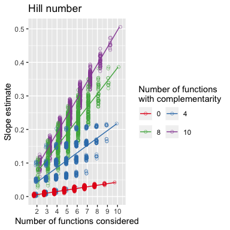

Effect of varying number of functions and species on the slope - using
species specific complementarities
================
Fabian Roger
2019-09-06

This script produces:

  - Figure 2 b & c

(see `Effect on averaging approach` below for Figure 2 a)

This script sets up the simulations to show the effect of including a
varying number of functions and (separately) a varying number of species
on the slope pattern produced by the multithreshold approach.

For the **variable number of function simulation** we hold species
richness constant at `specnum`.

We then define a set number of functions of size `funcnum` from which we
draw all possible (but max 50) subsets of variable size (3 subsets-sizes
total). For each subset of functions we calculate the multithreshold
approach.

For the **variable number of species simulation** we hold the number of
functions constant at `funcnum` but calculate the multithreshold
approach for the full species range and two smaller subsets.

# Effect on multithreshold approach

## Variable number of function simulation

### Simulate full diversity experiment

One can set the same parameters as in most other simulations:

  - `distribution` : the distribution function. The names of the
    parameters must be changed accordingly in `FunctionValue()`
  - `specnum` : the (maximum) number of species
  - `funcnum` : the (maximum) number of functions
  - `method` : the method to use (with or without complementarity)

Additional parameters for `method = comp`:

  - `CF` : maximum complementarity factor
  - `compfunc` : which functions should experience complementarity
    (`all` or any combination of `func.names`)
  - `r` : the *growthrate* of the complementarity factor

Here we use a maximum replication of 200 unique species combinations as
otherwise the computation becomes tedious.

``` r
set.seed(777)

specnum <- 10
funcnum <- 10

distribution = "runif"

FuncMat <- FunctionValue(specnum,funcnum, distribution, min = 0.1, max = 0.9)

func.names <- as.character( unique( FuncMat$Functions))
spec.names <- as.character( unique( FuncMat$Species))

#maxrep <- choose(specnum, floor(specnum/2))
maxrep <- 100 #using the full replications is prohibitive

SpecMat <- SpeciesMatrix(specnum = specnum, maxrep = maxrep)

method = "species_complementarity"

spec_comp <- SpecComp(specnum = specnum, funcnum = funcnum,
                     distribution = "rnorm", mean = 1, sd = 0.2,
                     spec_compfunc = func.names[1:3])

AvFunc <- AverageFunction(SpecMat, FuncMat,
                          method = method, 
                          spec_comp = spec_comp)

# set.seed(563)
# errM <- matrix(rnorm(n = nrow(AvFunc)*funcnum, mean = 0, sd = 0.01), ncol = funcnum)

#add variance
#AvFunc[,func.names] <- AvFunc[,func.names] + errM

# standardize functions 
AvFunc_func <- AvFunc %>% 
  mutate_at(vars(one_of(func.names)), function(x) {(x) / max(x)})
  #mutate_at(vars(one_of(func.names)), function(x) {(x - min(x)) / (max(x) - min(x))})
```

``` r
AvFunc %>%
mutate(meanFunction = rowMeans(.[,func.names])) %>% 
ggplot(., aes(x = Richness, y = meanFunction))+
  geom_point()+
  geom_smooth()
```

    ## `geom_smooth()` using method = 'loess' and formula 'y ~ x'

<!-- -->

### Variable number of function - Averaging

### simulation of all possible slopes for 1:`funcnum` functions

``` r
# empty dataframe to store results
Slope_res_ave <- data.frame(Estimate = numeric(),
                        `Std. Error` = numeric(),
                        `t value` = numeric(),    
                        `Pr(>|t|)` = numeric(),
                        nfunc = numeric(),
                        ncomp = numeric())

# loop over all possible number of functions with complementarity
for (l in 0:funcnum) {
  
set.seed(999)

# choose method = average if no functions with complementarity and method = comp otherwise
  if(l == 0) {
    method = "av"
  }  else {
    method = "species_complementarity"
    spec_compfunc = func.names[1:l]
  }

# draw complementarity
if(l > 0) {
  set.seed(78956)
spec_comp <- SpecComp(specnum = specnum, funcnum = funcnum,
                     distribution = "rnorm", mean = 1, sd = 0.2,
                     spec_compfunc = spec_compfunc)}

# draw function values and calculate mean function for all richness levels  
AvFunc <- AverageFunction(SpecMat, FuncMat,
                          method = method,
                          spec_comp = spec_comp)
  
set.seed(563)
errM <- matrix(rnorm(n = nrow(AvFunc)*funcnum, mean = 0, sd = 0.01), ncol = funcnum)

#add variance
AvFunc[,func.names] <- AvFunc[,func.names] + errM

# standardize functions
AvFunc <- AvFunc %>% 
  select(Richness, one_of(func.names)) %>% 
  mutate_at(vars(one_of(func.names)), function(x) {x / max(x)})
  #mutate_at(vars(one_of(func.names)), function(x) {(x - min(x)) / (max(x) - min(x))})


# loop over all subsets of function of size 1:funcnum
for (i in seq_len(funcnum)) { 

  # all poosibel combination of i out of funcnum functions
  func_comb <- combn(func.names, i)
  
  # loop over all function combinations of size i
  for ( k  in seq_len(ncol(func_comb))) { 
  
    # calculate mean function
    AvFunc_temp <- AvFunc %>%
      select(Richness, one_of(func_comb[ ,k])) %>% 
      mutate(meanFunction = rowMeans(.[func_comb[ ,k]]))
  
    # fit linear model
    mod <- lm(meanFunction ~ Richness, data = AvFunc_temp)
  
    # get slope estimate
    est <- summary(mod)$coefficients[2,]
    
    # store results
    Slope_res_ave <- data.frame(t(est)) %>% 
      mutate(., nfunc = i) %>% 
      mutate(ncomp = l) %>% 
      rbind(Slope_res_ave, .)
  }
}
}
```

### Plot

``` r
plot_av <- Slope_res_ave %>% 
  filter(ncomp %in% c(0,ceiling(funcnum/3),2*ceiling(funcnum/3),funcnum)) %>% 
  ggplot(aes(x = nfunc, y = Estimate, colour = as.factor(ncomp)))+
  geom_point(position = position_jitterdodge(jitter.width = 0.2, jitter.height = 0, dodge.width = 0.75),
             alpha = 0.5, shape = 21)+
  geom_smooth( se = F, size = 0.5, 
              position = position_dodge(width = 0.5))+
  scale_color_brewer(guide = guide_legend(title = "Number of functions\nwith complementarity",
                                          nrow=2,byrow=TRUE),
                     palette = "Set1")+
  scale_x_continuous(breaks = seq(1,funcnum,1))+
 # scale_y_continuous(limits = c(NA, 0.038))+
  labs(y = "Slope estimate",
       x = "Number of functions considered")+
  ggtitle("Averaging method") +
  theme_classic()+
  theme(legend.position = "bottom")
  
 plot_av 
```

    ## `geom_smooth()` using method = 'gam' and formula 'y ~ s(x, bs = "cs")'

    ## Warning: position_dodge requires non-overlapping x intervals

<!-- -->

### Variable number of function - PCA multifunc

``` r
# empty dataframe to store results
Slope_res_pca <- data.frame(Estimate = numeric(),
                        `Std. Error` = numeric(),
                        `t value` = numeric(),    
                        `Pr(>|t|)` = numeric(),
                        nfunc = numeric(),
                        ncomp = numeric())

# loop over all possible number of functions with complementarity
for (l in c(0,ceiling(funcnum/3),2*ceiling(funcnum/3),funcnum)) {
  
set.seed(999)

# choose method = average if no functions with complementarity and method = comp otherwise
  if(l == 0) {
    method = "av"
  }  else {
    method = "species_complementarity"
    spec_compfunc = func.names[1:l]
  }

# draw complementarity
if(l > 0) {
  set.seed(78956)
spec_comp <- SpecComp(specnum = specnum, funcnum = funcnum,
                     distribution = "rnorm", mean = 1, sd = 0.2,
                     spec_compfunc = spec_compfunc)}

# draw function values and calculate mean function for all richness levels  
AvFunc <- AverageFunction(SpecMat, FuncMat,
                          method = method,
                          spec_comp = spec_comp)
  
set.seed(563)
errM <- matrix(rnorm(n = nrow(AvFunc)*funcnum, mean = 0, sd = 0.01), ncol = funcnum)

#add variance
AvFunc[,func.names] <- AvFunc[,func.names] + errM

# standardize functions
AvFunc <- AvFunc %>% 
  select(Richness, one_of(func.names)) %>% 
  mutate_at(vars(one_of(func.names)), function(x) {x / max(x)})
  #mutate_at(vars(one_of(func.names)), function(x) {(x - min(x)) / (max(x) - min(x))})


# loop over all subsets of function of size 1:funcnum
for (i in seq_len(funcnum)) { 

  # all poosibel combination of i out of funcnum functions
  func_comb <- combn(func.names, i)
  
  # loop over all function combinations of size i
  for ( k  in seq_len(ncol(func_comb))) { 
  
    # calculate pca multifunc index
    AvFunc_temp <- pca_multifunc(AvFunc, vars = func_comb[ ,k]) 
    
    # fit linear model
    mod <- lm(multifunc_pca_ind ~ Richness, data = AvFunc_temp)
  
    # get slope estimate
    est <- summary(mod)$coefficients[2,]
    
    # store results
    Slope_res_pca <- data.frame(t(est)) %>% 
      mutate(., nfunc = i) %>% 
      mutate(ncomp = l) %>% 
      rbind(Slope_res_pca, .)
  }
}
}
```

### Plot

``` r
plot_pca <- Slope_res_pca %>% 
  filter(ncomp %in% c(0,ceiling(funcnum/3),2*ceiling(funcnum/3),funcnum)) %>% 
  ggplot(aes(x = nfunc, y = Estimate, colour = as.factor(ncomp)))+
  geom_point(position = position_jitterdodge(jitter.width = 0.2, jitter.height = 0, dodge.width = 0.75),
             alpha = 0.5, shape = 21)+
  geom_smooth(se = F, size = 0.5, 
              position = position_dodge(width = 0.5))+
  scale_color_brewer(guide = guide_legend(title = "Number of functions\nwith complementarity",
                                          nrow=2,byrow=TRUE),
                     palette = "Set1")+
  scale_x_continuous(breaks = seq(1,funcnum,1))+
  #scale_y_continuous(limits = c(NA, 0.038))+
  labs(y = "Slope estimate",
       x = "Number of functions considered")+
  ggtitle("PCA method")+
  theme_classic()+
  theme(legend.position = "bottom")
  
 plot_pca 
```

    ## `geom_smooth()` using method = 'gam' and formula 'y ~ s(x, bs = "cs")'

    ## Warning: position_dodge requires non-overlapping x intervals

<!-- -->

### Variable number of function - Sum multifunc

``` r
# empty dataframe to store results
Slope_res_sum <- data.frame(Estimate = numeric(),
                        `Std. Error` = numeric(),
                        `t value` = numeric(),    
                        `Pr(>|t|)` = numeric(),
                        nfunc = numeric(),
                        ncomp = numeric())

# loop over all possible number of functions with complementarity
for (l in c(0,ceiling(funcnum/3),2*ceiling(funcnum/3),funcnum)) {
  
set.seed(999)

# choose method = average if no functions with complementarity and method = comp otherwise
  if(l == 0) {
    method = "av"
  }  else {
    method = "species_complementarity"
    spec_compfunc = func.names[1:l]
  }

# draw complementarity
if(l > 0) {
  set.seed(78956)
spec_comp <- SpecComp(specnum = specnum, funcnum = funcnum,
                     distribution = "rnorm", mean = 1, sd = 0.2,
                     spec_compfunc = spec_compfunc)}

# draw function values and calculate mean function for all richness levels  
AvFunc <- AverageFunction(SpecMat, FuncMat,
                          method = method,
                          spec_comp = spec_comp)
  
set.seed(563)
errM <- matrix(rnorm(n = nrow(AvFunc)*funcnum, mean = 0, sd = 0.01), ncol = funcnum)

#add variance
AvFunc[,func.names] <- AvFunc[,func.names] + errM

# standardize functions
AvFunc <- AvFunc %>% 
  select(Richness, one_of(func.names)) %>% 
  mutate_at(vars(one_of(func.names)), function(x) {x / max(x)})
  #mutate_at(vars(one_of(func.names)), function(x) {(x - min(x)) / (max(x) - min(x))})


# loop over all subsets of function of size 1:funcnum
for (i in seq_len(funcnum)) { 

  # all poosibel combination of i out of funcnum functions
  func_comb <- combn(func.names, i)
  
  # loop over all function combinations of size i
  for ( k  in seq_len(ncol(func_comb))) { 
  
    # calculate sum of functions
    AvFunc_temp <- AvFunc %>%
      select(Richness, one_of(func_comb[ ,k])) %>% 
      mutate(sumFunction = rowSums(.[func_comb[ ,k]]))
  
  
    # fit linear model
    mod <- lm(sumFunction ~ Richness, data = AvFunc_temp)
  
    # get slope estimate
    est <- summary(mod)$coefficients[2,]
    
    # store results
    Slope_res_sum <- data.frame(t(est)) %>% 
      mutate(., nfunc = i) %>% 
      mutate(ncomp = l) %>% 
      rbind(Slope_res_sum, .)
  }
}
}
```

### Plot

``` r
plot_sum <- Slope_res_sum %>% 
  filter(ncomp %in% c(0,ceiling(funcnum/3),2*ceiling(funcnum/3),funcnum)) %>% 
  ggplot(aes(x = nfunc, y = Estimate, colour = as.factor(ncomp)))+
  geom_point(position = position_jitterdodge(jitter.width = 0.2, jitter.height = 0, dodge.width = 0.75),
             alpha = 0.5, shape = 21)+
  geom_smooth( se = F, size = 0.5, 
              position = position_dodge(width = 0.5))+
  scale_color_brewer(guide = guide_legend(title = "Number of functions\nwith complementarity",
                                          nrow=2,byrow=TRUE),
                     palette = "Set1")+
  scale_x_continuous(breaks = seq(1,funcnum,1))+
  #scale_y_continuous(limits = c(NA, 0.038))+
  labs(y = "Slope estimate",
       x = "Number of functions considered")+
  ggtitle("Summing approach") +
  theme_classic()+
  theme(legend.position = "bottom")
  
 plot_sum
```

    ## `geom_smooth()` using method = 'gam' and formula 'y ~ s(x, bs = "cs")'

    ## Warning: position_dodge requires non-overlapping x intervals

<!-- -->

### Variable number of function - Hill multifunc

``` r
# empty dataframe to store results
Slope_res_hill <- data.frame(Estimate = numeric(),
                        `Std. Error` = numeric(),
                        `t value` = numeric(),    
                        `Pr(>|t|)` = numeric(),
                        nfunc = numeric(),
                        ncomp = numeric())

# loop over all possible number of functions with complementarity
for (l in c(0,ceiling(funcnum/3),2*ceiling(funcnum/3),funcnum)) {
  
set.seed(999)

# choose method = average if no functions with complementarity and method = comp otherwise
  if(l == 0) {
    method = "av"
  }  else {
    method = "species_complementarity"
    spec_compfunc = func.names[1:l]
  }

# draw complementarity
if(l > 0) {
  set.seed(78956)
spec_comp <- SpecComp(specnum = specnum, funcnum = funcnum,
                     distribution = "rnorm", mean = 1, sd = 0.2,
                     spec_compfunc = spec_compfunc)}

# draw function values and calculate mean function for all richness levels  
AvFunc <- AverageFunction(SpecMat, FuncMat,
                          method = method,
                          spec_comp = spec_comp)
  
set.seed(563)
errM <- matrix(rnorm(n = nrow(AvFunc)*funcnum, mean = 0, sd = 0.01), ncol = funcnum)

#add variance
AvFunc[,func.names] <- AvFunc[,func.names] + errM

# standardize functions
AvFunc <- AvFunc %>% 
  select(Richness, one_of(func.names)) %>% 
  mutate_at(vars(one_of(func.names)), function(x) {x / max(x)})
  #mutate_at(vars(one_of(func.names)), function(x) {(x - min(x)) / (max(x) - min(x))})


# loop over all subsets of function of size 2:funcnum
for (i in 2:funcnum) { 

  # all poosibel combination of i out of funcnum functions
  func_comb <- combn(func.names, i)
  
  # loop over all function combinations of size i
  for ( k  in seq_len(ncol(func_comb))) { 
  
    # calculate sum of functions
    AvFunc_temp <- hill_multifunc(AvFunc, vars = func_comb[ ,k],
                                  scale = 1, HILL = TRUE)
  
    # fit linear model
    mod <- lm(multifunc_effN ~ Richness, data = AvFunc_temp)
  
    # get slope estimate
    est <- summary(mod)$coefficients[2,]
    
    # store results
    Slope_res_hill <- data.frame(t(est)) %>% 
      mutate(., nfunc = i) %>% 
      mutate(ncomp = l) %>% 
      rbind(Slope_res_hill, .)
  }
}
}
```

### Plot

``` r
plot_hill <- Slope_res_hill %>% 
  filter(ncomp %in% c(0,ceiling(funcnum/3),2*ceiling(funcnum/3),funcnum)) %>% 
  ggplot(aes(x = nfunc, y = Estimate, colour = as.factor(ncomp)))+
  geom_point(position = position_jitterdodge(jitter.width = 0.2, jitter.height = 0, dodge.width = 0.75),
             alpha = 0.5, shape = 21)+
  geom_smooth( se = F, size = 0.5, method ="lm",
              position = position_dodge(width = 0.5))+
  scale_color_brewer(guide = guide_legend(title = "Number of functions\nwith complementarity",
                                          nrow=2,byrow=TRUE),
                     palette = "Set1")+
  scale_x_continuous(breaks = seq(1,funcnum,1))+
  #scale_y_continuous(limits = c(NA, 0.038))+
  labs(y = "Slope estimate",
       x = "Number of functions considered")+
  ggtitle("Hill number")
  theme_classic()+
  theme(legend.position = "bottom")
```

    ## List of 66
    ##  $ line                      :List of 6
    ##   ..$ colour       : chr "black"
    ##   ..$ size         : num 0.5
    ##   ..$ linetype     : num 1
    ##   ..$ lineend      : chr "butt"
    ##   ..$ arrow        : logi FALSE
    ##   ..$ inherit.blank: logi TRUE
    ##   ..- attr(*, "class")= chr [1:2] "element_line" "element"
    ##  $ rect                      :List of 5
    ##   ..$ fill         : chr "white"
    ##   ..$ colour       : chr "black"
    ##   ..$ size         : num 0.5
    ##   ..$ linetype     : num 1
    ##   ..$ inherit.blank: logi TRUE
    ##   ..- attr(*, "class")= chr [1:2] "element_rect" "element"
    ##  $ text                      :List of 11
    ##   ..$ family       : chr ""
    ##   ..$ face         : chr "plain"
    ##   ..$ colour       : chr "black"
    ##   ..$ size         : num 11
    ##   ..$ hjust        : num 0.5
    ##   ..$ vjust        : num 0.5
    ##   ..$ angle        : num 0
    ##   ..$ lineheight   : num 0.9
    ##   ..$ margin       : 'margin' num [1:4] 0pt 0pt 0pt 0pt
    ##   .. ..- attr(*, "valid.unit")= int 8
    ##   .. ..- attr(*, "unit")= chr "pt"
    ##   ..$ debug        : logi FALSE
    ##   ..$ inherit.blank: logi TRUE
    ##   ..- attr(*, "class")= chr [1:2] "element_text" "element"
    ##  $ axis.title.x              :List of 11
    ##   ..$ family       : NULL
    ##   ..$ face         : NULL
    ##   ..$ colour       : NULL
    ##   ..$ size         : NULL
    ##   ..$ hjust        : NULL
    ##   ..$ vjust        : num 1
    ##   ..$ angle        : NULL
    ##   ..$ lineheight   : NULL
    ##   ..$ margin       : 'margin' num [1:4] 2.75pt 0pt 0pt 0pt
    ##   .. ..- attr(*, "valid.unit")= int 8
    ##   .. ..- attr(*, "unit")= chr "pt"
    ##   ..$ debug        : NULL
    ##   ..$ inherit.blank: logi TRUE
    ##   ..- attr(*, "class")= chr [1:2] "element_text" "element"
    ##  $ axis.title.x.top          :List of 11
    ##   ..$ family       : NULL
    ##   ..$ face         : NULL
    ##   ..$ colour       : NULL
    ##   ..$ size         : NULL
    ##   ..$ hjust        : NULL
    ##   ..$ vjust        : num 0
    ##   ..$ angle        : NULL
    ##   ..$ lineheight   : NULL
    ##   ..$ margin       : 'margin' num [1:4] 0pt 0pt 2.75pt 0pt
    ##   .. ..- attr(*, "valid.unit")= int 8
    ##   .. ..- attr(*, "unit")= chr "pt"
    ##   ..$ debug        : NULL
    ##   ..$ inherit.blank: logi TRUE
    ##   ..- attr(*, "class")= chr [1:2] "element_text" "element"
    ##  $ axis.title.y              :List of 11
    ##   ..$ family       : NULL
    ##   ..$ face         : NULL
    ##   ..$ colour       : NULL
    ##   ..$ size         : NULL
    ##   ..$ hjust        : NULL
    ##   ..$ vjust        : num 1
    ##   ..$ angle        : num 90
    ##   ..$ lineheight   : NULL
    ##   ..$ margin       : 'margin' num [1:4] 0pt 2.75pt 0pt 0pt
    ##   .. ..- attr(*, "valid.unit")= int 8
    ##   .. ..- attr(*, "unit")= chr "pt"
    ##   ..$ debug        : NULL
    ##   ..$ inherit.blank: logi TRUE
    ##   ..- attr(*, "class")= chr [1:2] "element_text" "element"
    ##  $ axis.title.y.right        :List of 11
    ##   ..$ family       : NULL
    ##   ..$ face         : NULL
    ##   ..$ colour       : NULL
    ##   ..$ size         : NULL
    ##   ..$ hjust        : NULL
    ##   ..$ vjust        : num 0
    ##   ..$ angle        : num -90
    ##   ..$ lineheight   : NULL
    ##   ..$ margin       : 'margin' num [1:4] 0pt 0pt 0pt 2.75pt
    ##   .. ..- attr(*, "valid.unit")= int 8
    ##   .. ..- attr(*, "unit")= chr "pt"
    ##   ..$ debug        : NULL
    ##   ..$ inherit.blank: logi TRUE
    ##   ..- attr(*, "class")= chr [1:2] "element_text" "element"
    ##  $ axis.text                 :List of 11
    ##   ..$ family       : NULL
    ##   ..$ face         : NULL
    ##   ..$ colour       : chr "grey30"
    ##   ..$ size         : 'rel' num 0.8
    ##   ..$ hjust        : NULL
    ##   ..$ vjust        : NULL
    ##   ..$ angle        : NULL
    ##   ..$ lineheight   : NULL
    ##   ..$ margin       : NULL
    ##   ..$ debug        : NULL
    ##   ..$ inherit.blank: logi TRUE
    ##   ..- attr(*, "class")= chr [1:2] "element_text" "element"
    ##  $ axis.text.x               :List of 11
    ##   ..$ family       : NULL
    ##   ..$ face         : NULL
    ##   ..$ colour       : NULL
    ##   ..$ size         : NULL
    ##   ..$ hjust        : NULL
    ##   ..$ vjust        : num 1
    ##   ..$ angle        : NULL
    ##   ..$ lineheight   : NULL
    ##   ..$ margin       : 'margin' num [1:4] 2.2pt 0pt 0pt 0pt
    ##   .. ..- attr(*, "valid.unit")= int 8
    ##   .. ..- attr(*, "unit")= chr "pt"
    ##   ..$ debug        : NULL
    ##   ..$ inherit.blank: logi TRUE
    ##   ..- attr(*, "class")= chr [1:2] "element_text" "element"
    ##  $ axis.text.x.top           :List of 11
    ##   ..$ family       : NULL
    ##   ..$ face         : NULL
    ##   ..$ colour       : NULL
    ##   ..$ size         : NULL
    ##   ..$ hjust        : NULL
    ##   ..$ vjust        : num 0
    ##   ..$ angle        : NULL
    ##   ..$ lineheight   : NULL
    ##   ..$ margin       : 'margin' num [1:4] 0pt 0pt 2.2pt 0pt
    ##   .. ..- attr(*, "valid.unit")= int 8
    ##   .. ..- attr(*, "unit")= chr "pt"
    ##   ..$ debug        : NULL
    ##   ..$ inherit.blank: logi TRUE
    ##   ..- attr(*, "class")= chr [1:2] "element_text" "element"
    ##  $ axis.text.y               :List of 11
    ##   ..$ family       : NULL
    ##   ..$ face         : NULL
    ##   ..$ colour       : NULL
    ##   ..$ size         : NULL
    ##   ..$ hjust        : num 1
    ##   ..$ vjust        : NULL
    ##   ..$ angle        : NULL
    ##   ..$ lineheight   : NULL
    ##   ..$ margin       : 'margin' num [1:4] 0pt 2.2pt 0pt 0pt
    ##   .. ..- attr(*, "valid.unit")= int 8
    ##   .. ..- attr(*, "unit")= chr "pt"
    ##   ..$ debug        : NULL
    ##   ..$ inherit.blank: logi TRUE
    ##   ..- attr(*, "class")= chr [1:2] "element_text" "element"
    ##  $ axis.text.y.right         :List of 11
    ##   ..$ family       : NULL
    ##   ..$ face         : NULL
    ##   ..$ colour       : NULL
    ##   ..$ size         : NULL
    ##   ..$ hjust        : num 0
    ##   ..$ vjust        : NULL
    ##   ..$ angle        : NULL
    ##   ..$ lineheight   : NULL
    ##   ..$ margin       : 'margin' num [1:4] 0pt 0pt 0pt 2.2pt
    ##   .. ..- attr(*, "valid.unit")= int 8
    ##   .. ..- attr(*, "unit")= chr "pt"
    ##   ..$ debug        : NULL
    ##   ..$ inherit.blank: logi TRUE
    ##   ..- attr(*, "class")= chr [1:2] "element_text" "element"
    ##  $ axis.ticks                :List of 6
    ##   ..$ colour       : chr "grey20"
    ##   ..$ size         : NULL
    ##   ..$ linetype     : NULL
    ##   ..$ lineend      : NULL
    ##   ..$ arrow        : logi FALSE
    ##   ..$ inherit.blank: logi TRUE
    ##   ..- attr(*, "class")= chr [1:2] "element_line" "element"
    ##  $ axis.ticks.length         : 'unit' num 2.75pt
    ##   ..- attr(*, "valid.unit")= int 8
    ##   ..- attr(*, "unit")= chr "pt"
    ##  $ axis.ticks.length.x       : NULL
    ##  $ axis.ticks.length.x.top   : NULL
    ##  $ axis.ticks.length.x.bottom: NULL
    ##  $ axis.ticks.length.y       : NULL
    ##  $ axis.ticks.length.y.left  : NULL
    ##  $ axis.ticks.length.y.right : NULL
    ##  $ axis.line                 :List of 6
    ##   ..$ colour       : chr "black"
    ##   ..$ size         : 'rel' num 1
    ##   ..$ linetype     : NULL
    ##   ..$ lineend      : NULL
    ##   ..$ arrow        : logi FALSE
    ##   ..$ inherit.blank: logi TRUE
    ##   ..- attr(*, "class")= chr [1:2] "element_line" "element"
    ##  $ axis.line.x               : NULL
    ##  $ axis.line.y               : NULL
    ##  $ legend.background         :List of 5
    ##   ..$ fill         : NULL
    ##   ..$ colour       : logi NA
    ##   ..$ size         : NULL
    ##   ..$ linetype     : NULL
    ##   ..$ inherit.blank: logi TRUE
    ##   ..- attr(*, "class")= chr [1:2] "element_rect" "element"
    ##  $ legend.margin             : 'margin' num [1:4] 5.5pt 5.5pt 5.5pt 5.5pt
    ##   ..- attr(*, "valid.unit")= int 8
    ##   ..- attr(*, "unit")= chr "pt"
    ##  $ legend.spacing            : 'unit' num 11pt
    ##   ..- attr(*, "valid.unit")= int 8
    ##   ..- attr(*, "unit")= chr "pt"
    ##  $ legend.spacing.x          : NULL
    ##  $ legend.spacing.y          : NULL
    ##  $ legend.key                : list()
    ##   ..- attr(*, "class")= chr [1:2] "element_blank" "element"
    ##  $ legend.key.size           : 'unit' num 1.2lines
    ##   ..- attr(*, "valid.unit")= int 3
    ##   ..- attr(*, "unit")= chr "lines"
    ##  $ legend.key.height         : NULL
    ##  $ legend.key.width          : NULL
    ##  $ legend.text               :List of 11
    ##   ..$ family       : NULL
    ##   ..$ face         : NULL
    ##   ..$ colour       : NULL
    ##   ..$ size         : 'rel' num 0.8
    ##   ..$ hjust        : NULL
    ##   ..$ vjust        : NULL
    ##   ..$ angle        : NULL
    ##   ..$ lineheight   : NULL
    ##   ..$ margin       : NULL
    ##   ..$ debug        : NULL
    ##   ..$ inherit.blank: logi TRUE
    ##   ..- attr(*, "class")= chr [1:2] "element_text" "element"
    ##  $ legend.text.align         : NULL
    ##  $ legend.title              :List of 11
    ##   ..$ family       : NULL
    ##   ..$ face         : NULL
    ##   ..$ colour       : NULL
    ##   ..$ size         : NULL
    ##   ..$ hjust        : num 0
    ##   ..$ vjust        : NULL
    ##   ..$ angle        : NULL
    ##   ..$ lineheight   : NULL
    ##   ..$ margin       : NULL
    ##   ..$ debug        : NULL
    ##   ..$ inherit.blank: logi TRUE
    ##   ..- attr(*, "class")= chr [1:2] "element_text" "element"
    ##  $ legend.title.align        : NULL
    ##  $ legend.position           : chr "bottom"
    ##  $ legend.direction          : NULL
    ##  $ legend.justification      : chr "center"
    ##  $ legend.box                : NULL
    ##  $ legend.box.margin         : 'margin' num [1:4] 0cm 0cm 0cm 0cm
    ##   ..- attr(*, "valid.unit")= int 1
    ##   ..- attr(*, "unit")= chr "cm"
    ##  $ legend.box.background     : list()
    ##   ..- attr(*, "class")= chr [1:2] "element_blank" "element"
    ##  $ legend.box.spacing        : 'unit' num 11pt
    ##   ..- attr(*, "valid.unit")= int 8
    ##   ..- attr(*, "unit")= chr "pt"
    ##  $ panel.background          :List of 5
    ##   ..$ fill         : chr "white"
    ##   ..$ colour       : logi NA
    ##   ..$ size         : NULL
    ##   ..$ linetype     : NULL
    ##   ..$ inherit.blank: logi TRUE
    ##   ..- attr(*, "class")= chr [1:2] "element_rect" "element"
    ##  $ panel.border              : list()
    ##   ..- attr(*, "class")= chr [1:2] "element_blank" "element"
    ##  $ panel.spacing             : 'unit' num 5.5pt
    ##   ..- attr(*, "valid.unit")= int 8
    ##   ..- attr(*, "unit")= chr "pt"
    ##  $ panel.spacing.x           : NULL
    ##  $ panel.spacing.y           : NULL
    ##  $ panel.grid                :List of 6
    ##   ..$ colour       : chr "grey92"
    ##   ..$ size         : NULL
    ##   ..$ linetype     : NULL
    ##   ..$ lineend      : NULL
    ##   ..$ arrow        : logi FALSE
    ##   ..$ inherit.blank: logi TRUE
    ##   ..- attr(*, "class")= chr [1:2] "element_line" "element"
    ##  $ panel.grid.minor          : list()
    ##   ..- attr(*, "class")= chr [1:2] "element_blank" "element"
    ##  $ panel.ontop               : logi FALSE
    ##  $ plot.background           :List of 5
    ##   ..$ fill         : NULL
    ##   ..$ colour       : chr "white"
    ##   ..$ size         : NULL
    ##   ..$ linetype     : NULL
    ##   ..$ inherit.blank: logi TRUE
    ##   ..- attr(*, "class")= chr [1:2] "element_rect" "element"
    ##  $ plot.title                :List of 11
    ##   ..$ family       : NULL
    ##   ..$ face         : NULL
    ##   ..$ colour       : NULL
    ##   ..$ size         : 'rel' num 1.2
    ##   ..$ hjust        : num 0
    ##   ..$ vjust        : num 1
    ##   ..$ angle        : NULL
    ##   ..$ lineheight   : NULL
    ##   ..$ margin       : 'margin' num [1:4] 0pt 0pt 5.5pt 0pt
    ##   .. ..- attr(*, "valid.unit")= int 8
    ##   .. ..- attr(*, "unit")= chr "pt"
    ##   ..$ debug        : NULL
    ##   ..$ inherit.blank: logi TRUE
    ##   ..- attr(*, "class")= chr [1:2] "element_text" "element"
    ##  $ plot.subtitle             :List of 11
    ##   ..$ family       : NULL
    ##   ..$ face         : NULL
    ##   ..$ colour       : NULL
    ##   ..$ size         : NULL
    ##   ..$ hjust        : num 0
    ##   ..$ vjust        : num 1
    ##   ..$ angle        : NULL
    ##   ..$ lineheight   : NULL
    ##   ..$ margin       : 'margin' num [1:4] 0pt 0pt 5.5pt 0pt
    ##   .. ..- attr(*, "valid.unit")= int 8
    ##   .. ..- attr(*, "unit")= chr "pt"
    ##   ..$ debug        : NULL
    ##   ..$ inherit.blank: logi TRUE
    ##   ..- attr(*, "class")= chr [1:2] "element_text" "element"
    ##  $ plot.caption              :List of 11
    ##   ..$ family       : NULL
    ##   ..$ face         : NULL
    ##   ..$ colour       : NULL
    ##   ..$ size         : 'rel' num 0.8
    ##   ..$ hjust        : num 1
    ##   ..$ vjust        : num 1
    ##   ..$ angle        : NULL
    ##   ..$ lineheight   : NULL
    ##   ..$ margin       : 'margin' num [1:4] 5.5pt 0pt 0pt 0pt
    ##   .. ..- attr(*, "valid.unit")= int 8
    ##   .. ..- attr(*, "unit")= chr "pt"
    ##   ..$ debug        : NULL
    ##   ..$ inherit.blank: logi TRUE
    ##   ..- attr(*, "class")= chr [1:2] "element_text" "element"
    ##  $ plot.tag                  :List of 11
    ##   ..$ family       : NULL
    ##   ..$ face         : NULL
    ##   ..$ colour       : NULL
    ##   ..$ size         : 'rel' num 1.2
    ##   ..$ hjust        : num 0.5
    ##   ..$ vjust        : num 0.5
    ##   ..$ angle        : NULL
    ##   ..$ lineheight   : NULL
    ##   ..$ margin       : NULL
    ##   ..$ debug        : NULL
    ##   ..$ inherit.blank: logi TRUE
    ##   ..- attr(*, "class")= chr [1:2] "element_text" "element"
    ##  $ plot.tag.position         : chr "topleft"
    ##  $ plot.margin               : 'margin' num [1:4] 5.5pt 5.5pt 5.5pt 5.5pt
    ##   ..- attr(*, "valid.unit")= int 8
    ##   ..- attr(*, "unit")= chr "pt"
    ##  $ strip.background          :List of 5
    ##   ..$ fill         : chr "white"
    ##   ..$ colour       : chr "black"
    ##   ..$ size         : 'rel' num 2
    ##   ..$ linetype     : NULL
    ##   ..$ inherit.blank: logi TRUE
    ##   ..- attr(*, "class")= chr [1:2] "element_rect" "element"
    ##  $ strip.placement           : chr "inside"
    ##  $ strip.text                :List of 11
    ##   ..$ family       : NULL
    ##   ..$ face         : NULL
    ##   ..$ colour       : chr "grey10"
    ##   ..$ size         : 'rel' num 0.8
    ##   ..$ hjust        : NULL
    ##   ..$ vjust        : NULL
    ##   ..$ angle        : NULL
    ##   ..$ lineheight   : NULL
    ##   ..$ margin       : 'margin' num [1:4] 4.4pt 4.4pt 4.4pt 4.4pt
    ##   .. ..- attr(*, "valid.unit")= int 8
    ##   .. ..- attr(*, "unit")= chr "pt"
    ##   ..$ debug        : NULL
    ##   ..$ inherit.blank: logi TRUE
    ##   ..- attr(*, "class")= chr [1:2] "element_text" "element"
    ##  $ strip.text.x              : NULL
    ##  $ strip.text.y              :List of 11
    ##   ..$ family       : NULL
    ##   ..$ face         : NULL
    ##   ..$ colour       : NULL
    ##   ..$ size         : NULL
    ##   ..$ hjust        : NULL
    ##   ..$ vjust        : NULL
    ##   ..$ angle        : num -90
    ##   ..$ lineheight   : NULL
    ##   ..$ margin       : NULL
    ##   ..$ debug        : NULL
    ##   ..$ inherit.blank: logi TRUE
    ##   ..- attr(*, "class")= chr [1:2] "element_text" "element"
    ##  $ strip.switch.pad.grid     : 'unit' num 2.75pt
    ##   ..- attr(*, "valid.unit")= int 8
    ##   ..- attr(*, "unit")= chr "pt"
    ##  $ strip.switch.pad.wrap     : 'unit' num 2.75pt
    ##   ..- attr(*, "valid.unit")= int 8
    ##   ..- attr(*, "unit")= chr "pt"
    ##  $ panel.grid.major          : list()
    ##   ..- attr(*, "class")= chr [1:2] "element_blank" "element"
    ##  - attr(*, "class")= chr [1:2] "theme" "gg"
    ##  - attr(*, "complete")= logi TRUE
    ##  - attr(*, "validate")= logi TRUE

``` r
 plot_hill
```

    ## Warning: position_dodge requires non-overlapping x intervals

<!-- -->
